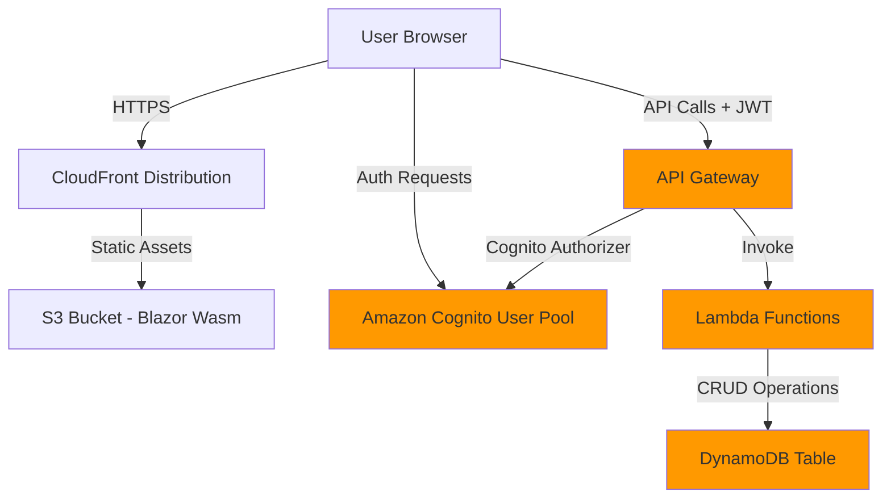

# Design Document

## Overview

Mountain Leads is a serverless lead management application built on AWS infrastructure with a .NET Blazor WebAssembly frontend. The architecture follows a three-tier pattern: presentation (Blazor WebAssembly), API (AWS API Gateway + Lambda), and data (DynamoDB). Authentication and authorization are handled by Amazon Cognito, ensuring secure, user-isolated access to lead data.

The system leverages AWS CDK for infrastructure-as-code deployment, with all resources named and configured based on the domain `leads.mountaintechnologiesllc.com`. The existing S3/CloudFront infrastructure will be enhanced to include Cognito User Pool, DynamoDB table, API Gateway REST API, and Lambda functions for CRUD operations.

## Architecture

### High-Level Architecture



### Component Layers

1. **Presentation Layer**: Blazor WebAssembly SPA served from S3 via CloudFront
2. **Authentication Layer**: Amazon Cognito User Pool with email/password authentication
3. **API Layer**: API Gateway with Cognito authorizer and Lambda integration
4. **Business Logic Layer**: .NET Lambda functions handling CRUD operations
5. **Data Layer**: DynamoDB with single-table design for user-isolated lead storage

### Data Flow

1. User registers/authenticates via Cognito SDK in Blazor app
2. Cognito returns JWT tokens (ID token, access token, refresh token)
3. Blazor app includes ID token in Authorization header for API requests
4. API Gateway validates token with Cognito authorizer
5. Lambda function extracts user ID from token claims
6. Lambda performs CRUD operation with user ID as partition key
7. DynamoDB returns results filtered by user ID
8. Response flows back through Lambda → API Gateway → Blazor app

## Components and Interfaces

### 1. Blazor WebAssembly Application

**Location**: `./website/`

**Key Components**:
- `Program.cs`: Application entry point, service registration
- `Pages/Login.razor`: Login page with Cognito authentication
- `Pages/Register.razor`: Registration page with email/password
- `Pages/Dashboard.razor`: Main dashboard with lead table and CRUD operations
- `Services/AuthService.cs`: Cognito authentication wrapper
- `Services/LeadService.cs`: HTTP client for API Gateway endpoints
- `Models/Lead.cs`: Lead data model
- `Models/User.cs`: User authentication model

**Dependencies**:
- Amazon.Extensions.CognitoAuthentication
- Microsoft.AspNetCore.Components.WebAssembly
- System.Net.Http.Json

**Configuration**:
```json
{
  "AWS": {
    "Region": "us-east-1",
    "UserPoolId": "us-east-1_XXXXXXXXX",
    "ClientId": "XXXXXXXXXXXXXXXXXXXXXXXXXX",
    "ApiGatewayUrl": "https://XXXXXXXXXX.execute-api.us-east-1.amazonaws.com/prod"
  }
}
```

### 2. Amazon Cognito User Pool

**CDK Construct**: `CognitoConstruct.cs`

**Configuration**:
- User Pool Name: `leads-mountaintechnologiesllc-com-users`
- Sign-in: Email only
- Password Policy: Minimum 8 characters, requires uppercase, lowercase, number
- MFA: Optional (disabled by default)
- Email Verification: Required
- User Pool Client: No client secret (for public SPA)

**Outputs**:
- User Pool ID
- User Pool Client ID
- User Pool Domain (for hosted UI, optional)

### 3. DynamoDB Table

**CDK Construct**: `DynamoDbConstruct.cs`

**Table Design**:
- Table Name: `leads-mountaintechnologiesllc-com`
- Partition Key: `userId` (String) - Cognito sub claim
- Sort Key: `leadId` (String) - UUID
- Attributes: name, title, company, phone, email, location, notes, createdAt, updatedAt
- Billing Mode: PAY_PER_REQUEST (on-demand)
- Point-in-Time Recovery: Enabled
- Deletion Protection: Disabled (for development)

**Access Patterns**:
1. Get all leads for a user: Query by `userId`
2. Get specific lead: Query by `userId` and `leadId`
3. Create lead: PutItem with `userId` and generated `leadId`
4. Update lead: UpdateItem with `userId` and `leadId`
5. Delete lead: DeleteItem with `userId` and `leadId`

### 4. API Gateway

**CDK Construct**: `ApiGatewayConstruct.cs`

**REST API Configuration**:
- API Name: `leads-mountaintechnologiesllc-com-api`
- Stage: `prod`
- CORS: Enabled for CloudFront domain
- Authorizer: Cognito User Pool authorizer

**Endpoints**:
```
POST   /leads              - Create lead
GET    /leads              - List all leads for user
GET    /leads/{leadId}     - Get specific lead
PUT    /leads/{leadId}     - Update lead
DELETE /leads/{leadId}     - Delete lead
POST   /leads/init         - Initialize default leads (called after registration)
```

**Request/Response Models**:
```json
// Lead Request/Response
{
  "leadId": "uuid",
  "name": "string",
  "title": "string",
  "company": "string",
  "phone": "string",
  "email": "string",
  "location": "string",
  "notes": "string",
  "createdAt": "ISO8601",
  "updatedAt": "ISO8601"
}

// List Response
{
  "leads": [Lead],
  "count": number
}
```

### 5. Lambda Functions

**CDK Construct**: `LambdaConstruct.cs`

**Functions**:
1. **CreateLeadFunction**: Handles POST /leads
2. **ListLeadsFunction**: Handles GET /leads
3. **GetLeadFunction**: Handles GET /leads/{leadId}
4. **UpdateLeadFunction**: Handles PUT /leads/{leadId}
5. **DeleteLeadFunction**: Handles DELETE /leads/{leadId}
6. **InitLeadsFunction**: Handles POST /leads/init

**Runtime**: .NET 8 (Amazon.Lambda.AspNetCoreServer)

**Environment Variables**:
- `TABLE_NAME`: DynamoDB table name
- `AWS_REGION`: Deployment region

**IAM Permissions**:
- DynamoDB: PutItem, GetItem, Query, UpdateItem, DeleteItem
- CloudWatch Logs: CreateLogGroup, CreateLogStream, PutLogEvents

**Shared Logic**:
- User ID extraction from JWT claims (`cognito:username` or `sub`)
- Input validation
- Error handling and logging
- DynamoDB client initialization

### 6. CDK Infrastructure Stack

**Enhanced Stack Structure**:
```
InfrastructureStack
├── BucketConstruct (existing)
├── DistributionConstruct (existing)
├── BucketDeploymentConstruct (existing)
├── CognitoConstruct (new)
├── DynamoDbConstruct (new)
├── LambdaConstruct (new)
└── ApiGatewayConstruct (new)
```

**Stack Outputs**:
- S3 Bucket Name
- CloudFront Distribution URL
- Cognito User Pool ID
- Cognito Client ID
- API Gateway URL
- DynamoDB Table Name

## Data Models

### Lead Model

```csharp
public class Lead
{
    public string UserId { get; set; }        // Partition key
    public string LeadId { get; set; }        // Sort key (UUID)
    public string Name { get; set; }          // Required
    public string Title { get; set; }         // Optional
    public string Company { get; set; }       // Optional
    public string Phone { get; set; }         // Optional
    public string Email { get; set; }         // Optional
    public string Location { get; set; }      // Optional
    public string Notes { get; set; }         // Optional
    public DateTime CreatedAt { get; set; }   // Auto-generated
    public DateTime UpdatedAt { get; set; }   // Auto-updated
}
```

### User Authentication Model

```csharp
public class UserCredentials
{
    public string Email { get; set; }
    public string Password { get; set; }
}

public class AuthenticationResult
{
    public string IdToken { get; set; }
    public string AccessToken { get; set; }
    public string RefreshToken { get; set; }
    public int ExpiresIn { get; set; }
}
```

### API Request/Response Models

```csharp
public class CreateLeadRequest
{
    public string Name { get; set; }
    public string Title { get; set; }
    public string Company { get; set; }
    public string Phone { get; set; }
    public string Email { get; set; }
    public string Location { get; set; }
    public string Notes { get; set; }
}

public class UpdateLeadRequest : CreateLeadRequest
{
    // Inherits all fields from CreateLeadRequest
}

public class LeadResponse
{
    public Lead Lead { get; set; }
}

public class ListLeadsResponse
{
    public List<Lead> Leads { get; set; }
    public int Count { get; set; }
}

public class ErrorResponse
{
    public string Message { get; set; }
    public string Code { get; set; }
}
```


## Correctness Properties

*A property is a characteristic or behavior that should hold true across all valid executions of a system—essentially, a formal statement about what the system should do. Properties serve as the bridge between human-readable specifications and machine-verifiable correctness guarantees.*

### Registration Properties

**Property 1: User registration creates Cognito account**
*For any* valid email and password combination, submitting registration credentials should create a new user account in the Amazon Cognito User Pool that can be subsequently authenticated.
**Validates: Requirements 1.1**

**Property 2: Default Anthony Pearson lead creation**
*For any* user registration, the system should create a lead record with exact values: name="Anthony Pearson", title="CTO", company="Mountain Technologies LLC", phone="952-111-1111", email="info@mountaintechnologiesllc.com", location="Minneapolis, MN", notes="Likes to code".
**Validates: Requirements 1.2**

**Property 3: User email lead creation**
*For any* user registration with email address E, the system should create a lead record with email=E and all other fields (name, title, company, phone, location, notes) empty or null.
**Validates: Requirements 1.3**

**Property 4: Invalid registration rejection**
*For any* invalid registration data (malformed email, weak password, missing required fields), the system should reject the registration, return an error message, and not create a Cognito account.
**Validates: Requirements 1.4**

### Authentication Properties

**Property 5: Valid credential authentication**
*For any* registered user with valid credentials, authentication should succeed and return JWT tokens (idToken, accessToken, refreshToken) with valid structure and claims.
**Validates: Requirements 2.1, 2.3**

**Property 6: Invalid credential rejection**
*For any* invalid credentials (wrong password, non-existent user, malformed input), authentication should fail and return an error message without granting access.
**Validates: Requirements 2.2**

**Property 7: Logout session invalidation**
*For any* authenticated session, performing logout should clear authentication tokens and prevent subsequent API requests from succeeding with those tokens.
**Validates: Requirements 2.5**

### Lead Creation Properties

**Property 8: Authorized lead creation and storage**
*For any* authenticated user and valid lead data, creating a lead should store it in DynamoDB with a unique leadId, the user's userId, and all provided field values, and the lead should be retrievable in subsequent queries.
**Validates: Requirements 3.1, 3.3, 3.4**

**Property 9: API authorization requirement**
*For any* API request (create, read, update, delete), the request should fail with an authorization error if the authentication token is missing, invalid, or expired.
**Validates: Requirements 3.2, 4.5, 5.2, 6.2**

**Property 10: Lead creation failure handling**
*For any* lead creation request that fails validation or processing, the system should return an error message and not create a lead record in DynamoDB.
**Validates: Requirements 3.5**

### Lead Retrieval Properties

**Property 11: User data isolation**
*For any* two distinct users U1 and U2, where U1 creates leads L1 and U2 creates leads L2, querying leads as U1 should return only L1, and querying as U2 should return only L2, with no overlap.
**Validates: Requirements 4.1, 9.1, 9.2, 9.4, 9.5**

**Property 12: Lead data completeness**
*For any* lead retrieved from the API, the response should contain all required fields: leadId, userId, name, title, company, phone, email, location, notes, createdAt, updatedAt.
**Validates: Requirements 4.2**

**Property 13: Unauthenticated access denial**
*For any* API request without a valid authentication token, the system should deny access and return an authorization error without processing the request.
**Validates: Requirements 4.4**

### Lead Update Properties

**Property 14: Authorized lead update and consistency**
*For any* authenticated user's lead and valid update data, updating the lead should persist the changes to DynamoDB, and subsequent retrieval of that lead should return the updated values.
**Validates: Requirements 5.1, 5.3**

**Property 15: Cross-user modification prevention**
*For any* two distinct users U1 and U2, where U1 creates a lead L, any attempt by U2 to update or delete L should be rejected with an authorization error, and L should remain unchanged.
**Validates: Requirements 5.2, 5.5, 6.2, 6.4**

**Property 16: Update failure data preservation**
*For any* lead update or delete operation that fails (validation error, authorization error, system error), the original lead data should remain unchanged in DynamoDB.
**Validates: Requirements 5.4, 6.5**

### Lead Deletion Properties

**Property 17: Authorized lead deletion and removal**
*For any* authenticated user's lead, deleting the lead should remove it from DynamoDB, and subsequent queries should not return the deleted lead.
**Validates: Requirements 6.1, 6.3**

### Token and Authorization Properties

**Property 18: JWT token inclusion and extraction**
*For any* API request from the Blazor application, the request should include the Cognito JWT token in the Authorization header, and the Lambda function should correctly extract the userId from the token claims (sub or cognito:username).
**Validates: Requirements 8.1, 9.3**

**Property 19: API response handling**
*For any* API response (success or error), the Blazor application should handle the response appropriately based on the HTTP status code and response body structure.
**Validates: Requirements 8.2**

## Error Handling

### Error Categories

1. **Authentication Errors**
   - Invalid credentials
   - Expired tokens
   - Missing tokens
   - Malformed tokens

2. **Authorization Errors**
   - Accessing another user's leads
   - Invalid user ID in token
   - Token signature validation failure

3. **Validation Errors**
   - Missing required fields
   - Invalid email format
   - Weak password
   - Invalid lead data

4. **System Errors**
   - DynamoDB service errors
   - Lambda timeout
   - API Gateway errors
   - Network failures

### Error Response Format

All API errors should return consistent JSON structure:

```json
{
  "error": {
    "code": "ERROR_CODE",
    "message": "Human-readable error message",
    "details": {}
  }
}
```

### Error Codes

- `AUTH_INVALID_CREDENTIALS`: Invalid email or password
- `AUTH_TOKEN_EXPIRED`: JWT token has expired
- `AUTH_TOKEN_MISSING`: No authorization token provided
- `AUTH_UNAUTHORIZED`: User not authorized for this resource
- `VALIDATION_FAILED`: Input validation failed
- `RESOURCE_NOT_FOUND`: Lead not found
- `INTERNAL_ERROR`: Unexpected system error

### Lambda Error Handling

Each Lambda function should:
1. Catch all exceptions
2. Log errors to CloudWatch with context
3. Return appropriate HTTP status codes (400, 401, 403, 404, 500)
4. Never expose internal error details to clients
5. Validate all inputs before processing

### Blazor Error Handling

The Blazor application should:
1. Display user-friendly error messages
2. Handle network failures gracefully
3. Retry failed requests with exponential backoff (for transient errors)
4. Redirect to login on authentication errors
5. Log errors to browser console for debugging

## Testing Strategy

### Unit Testing

**Blazor Application**:
- Test AuthService authentication flows
- Test LeadService HTTP client methods
- Test component rendering and state management
- Test form validation logic
- Mock HTTP responses for isolated testing

**Lambda Functions**:
- Test CRUD operation logic
- Test user ID extraction from JWT claims
- Test input validation
- Test error handling paths
- Mock DynamoDB client for isolated testing

**CDK Infrastructure**:
- Snapshot tests for CloudFormation templates
- Validate resource properties and configurations
- Test construct composition

### Property-Based Testing

Property-based testing will be implemented using:
- **Blazor/C#**: FsCheck or CsCheck
- **Lambda/C#**: FsCheck or CsCheck

Each correctness property will be implemented as a property-based test that:
1. Generates random valid inputs (users, leads, tokens)
2. Executes the operation
3. Verifies the property holds
4. Runs a minimum of 100 iterations per property

Property tests should:
- Generate realistic test data (valid emails, UUIDs, etc.)
- Test edge cases (empty strings, special characters, boundary values)
- Verify properties across different user scenarios
- Test concurrent operations where applicable

### Integration Testing

**End-to-End Tests**:
- User registration → authentication → CRUD operations flow
- Multi-user isolation verification
- Token expiration and refresh flows
- Error handling across the full stack

**API Integration Tests**:
- Test API Gateway + Lambda + DynamoDB integration
- Test Cognito authorizer with real tokens
- Test CORS configuration
- Test error responses

### Infrastructure Testing

**CDK Deployment Tests**:
- Deploy to test environment
- Verify all resources created successfully
- Test API endpoints are accessible
- Verify Cognito user pool configuration
- Test DynamoDB table structure

**Smoke Tests**:
- Register a test user
- Authenticate
- Create, read, update, delete a lead
- Verify data isolation

### Testing Tools

- **Unit Tests**: xUnit, NUnit, or MSTest
- **Property-Based Tests**: FsCheck or CsCheck
- **Mocking**: Moq or NSubstitute
- **Integration Tests**: xUnit with WebApplicationFactory
- **E2E Tests**: Playwright or Selenium
- **Load Tests**: k6 or Artillery (optional)

### Test Data Management

- Use test fixtures for consistent test data
- Generate random data for property tests
- Clean up test data after integration tests
- Use separate AWS account or isolated resources for testing
- Never test against production resources

### Continuous Integration

- Run unit tests on every commit
- Run property tests on every commit
- Run integration tests on pull requests
- Deploy to test environment on merge to main
- Run smoke tests after deployment

## Implementation Notes

### Blazor WebAssembly Considerations

1. **Authentication Flow**: Use Amazon.Extensions.CognitoAuthentication for Cognito SDK integration
2. **HTTP Client**: Configure HttpClient with base address and default headers
3. **State Management**: Use Blazor's built-in state management or Fluxor for complex state
4. **Routing**: Implement route guards for authenticated pages
5. **Configuration**: Load AWS configuration from appsettings.json or environment variables

### Lambda Function Considerations

1. **Cold Start Optimization**: Minimize dependencies, use Lambda SnapStart if available
2. **Connection Pooling**: Reuse DynamoDB client across invocations
3. **Logging**: Use structured logging with correlation IDs
4. **Timeout**: Set appropriate timeout values (default 30 seconds)
5. **Memory**: Start with 512MB, adjust based on performance metrics

### DynamoDB Considerations

1. **Partition Key Design**: Use userId as partition key for even distribution
2. **Sort Key Design**: Use leadId (UUID) for uniqueness and sortability
3. **Indexes**: No GSI needed for current access patterns
4. **Capacity**: Use on-demand billing for unpredictable workloads
5. **Backup**: Enable point-in-time recovery for data protection

### API Gateway Considerations

1. **Throttling**: Configure per-user rate limits to prevent abuse
2. **Caching**: Disable caching for authenticated endpoints
3. **CORS**: Configure allowed origins, methods, and headers
4. **Request Validation**: Enable request validation models
5. **Logging**: Enable CloudWatch logging for debugging

### Security Considerations

1. **HTTPS Only**: Enforce HTTPS for all communications
2. **Token Storage**: Store tokens securely in browser (sessionStorage or memory)
3. **CORS**: Restrict to CloudFront domain only
4. **IAM Policies**: Follow principle of least privilege
5. **Secrets**: Never expose Cognito client secret (use public client)
6. **Input Validation**: Validate and sanitize all user inputs
7. **SQL Injection**: Not applicable (NoSQL), but validate all query parameters

### Performance Considerations

1. **Blazor Bundle Size**: Minimize dependencies, use lazy loading
2. **API Latency**: Target <200ms for CRUD operations
3. **DynamoDB**: Single-digit millisecond latency for queries
4. **CloudFront**: Edge caching for static assets
5. **Lambda**: Optimize cold start time (<1 second)

### Monitoring and Observability

1. **CloudWatch Metrics**: Monitor Lambda invocations, errors, duration
2. **CloudWatch Logs**: Centralized logging for all components
3. **X-Ray**: Distributed tracing for API requests (optional)
4. **Alarms**: Set up alarms for error rates, latency, throttling
5. **Dashboards**: Create CloudWatch dashboard for key metrics

### Deployment Strategy

1. **Infrastructure First**: Deploy CDK stack before Blazor app
2. **Configuration**: Update Blazor appsettings.json with CDK outputs
3. **Build**: Compile Blazor to static files
4. **Deploy**: Upload to S3, invalidate CloudFront cache
5. **Verify**: Run smoke tests against deployed environment

### Future Enhancements

1. **Email Verification**: Require email verification before login
2. **Password Reset**: Implement forgot password flow
3. **MFA**: Add multi-factor authentication option
4. **Lead Import/Export**: Bulk operations for leads
5. **Search and Filter**: Advanced lead search capabilities
6. **Pagination**: Implement pagination for large lead lists
7. **Audit Log**: Track all CRUD operations for compliance
8. **Real-time Updates**: WebSocket support for live updates
9. **Mobile App**: Native mobile applications
10. **Analytics**: Usage analytics and reporting
